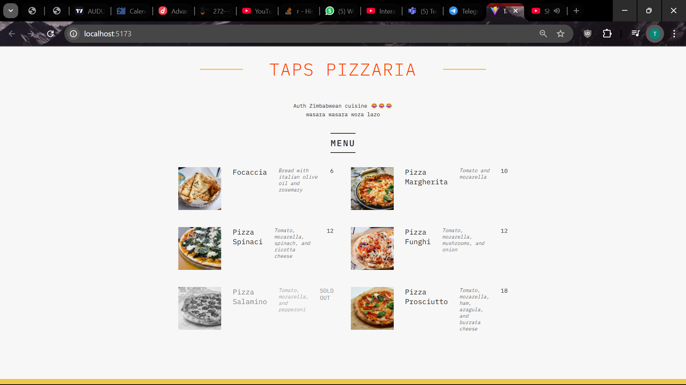

## Table of contents

- [Overview](#overview)
  - [Screenshot](#screenshot)
  - [Built with](#built-with)
  - [What I learned](#what-i-learned)
  - [Running the Application](#Running-the-Application)
  - [Useful resources](#useful-resource)
- [Author](#author)

## Overview

A simple single page react Pizzaria application built from Fundamental React concepts

### Screenshots

### Built with

- React using vite

### What I learned

- Props - sharing data between components
- Destructuring props
- React components and nested components
- Conditional Rendering (&&, ternary, )
- Javascript Concepts
  - Destructuring (objects and arrays)
  - Rest and Spread Operators
  - Short Circuiting (&&, || )
  - Methods (map, reduce, sort, filter)
  - Asynchronous JS (promises, async await)
- Setting Classes and Text conditionally

### Running the Application

- Download zip or clone on local environment
- Navigate to prsoject workspace and install dependencies -> npm i
- Run the application -> npm run dev

## Author

- Website - [Tapiwa Chimbwanda](https://tapiwa.me/)
- Twitter - [@Tapiwa\_\_C](https://x.com/Tapiwa__C)
- LinkedIn - [Tapiwa Chimbwanda](https://www.linkedin.com/in/ctapiwa/)

## useful-resource

[Carousel](https://codesandbox.io)

